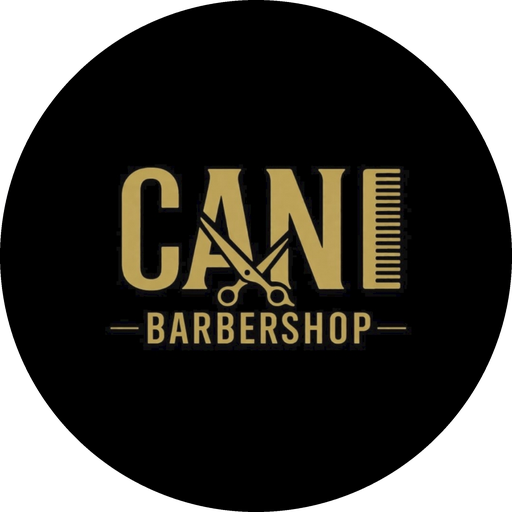

# CANI Barber Tycoon 💈



**Game by [xardiig](https://www.instagram.com/xardiig/)** · for CANI Barbershop

A 3D isometric barbershop tycoon game (in the spirit of burger-shop tycoon games) that runs in the browser.
The shop is rendered in real-time 3D with Three.js (lighting, shadows, lamps that glow in the evening).
A classic 2D view is available in the ⚙️ menu and is used automatically when WebGL isn't available.
You start as **Cani**, cutting hair alone in your parents' garage, and grow the business into the **Cani Empire HQ**.

## Play

Open `index.html` in any modern browser. No build step or server needed.
You can also serve the folder, for example with `npx serve .`.

## How it works

**You run the floor with your fingers:**

- 👆 **Seat customers:** tap a waiting customer, then tap a glowing chair. Or tap a free chair to call the next person in line.
  A free barber walks over on their own.
- ✂️ **Speed up cuts:** tap a customer (or their barber) during the cut.
- 💵 **Take payment:** when a cut is done, tap the customer, then tap the register. Tap the register again to ring them up.
  Fast checkout earns a bigger tip. Customers left waiting too long leave without tipping.
- 🧹 **Sweep:** tap hair on the floor. A dirty floor makes customers unhappy.
- 🧾 **Pay bills:** rent and supplies arrive every day, electricity and water every 3 days, internet every 5 and taxes every 7.
  Late bills add a 10% fee each night and cost reputation. Unpaid electricity causes a power cut (dark shop, slower cuts, TVs off);
  unpaid water stops sinks and color stations.
- ⭐ **Cani Coins → real coupons:** earn coins from 3 daily goals (tap Claim), by tapping the purple coins super-happy
  customers drop, from the daily opening bonus and by expanding. In the **Rewards** tab players exchange coins for
  **real coupons at the barbershop**: free coffee, 10% off, 20% off, free beard trim, free haircut. Each coupon gets a
  one-time code and QR code to show at the counter (see *Real rewards* below).
- 📸 **Instagram bonus:** in Rewards, tap **Follow** to open [@xardiig](https://www.instagram.com/xardiig/) on
  Instagram, then **Claim** ⭐50 once. Instagram doesn't let games check who follows an account, so this is on trust
  (one claim per player/account). The list lives in `server/social.json`; add the barbershop's own account there too.
- 🙋 **Proactive Barbers** (Upgrades → Barber skills, $450, available from the garage): a free barber calls the
  customer who has waited longest to a chair by themselves.
- 💵 **Barbers Take Payment** (Barber skills, $600): when a cut is done the barber takes the money at the chair.
- 🪑 **Placement rules:** barber chairs, sinks and color stations go **against a wall** (mirror and plumbing), with a
  free tile between stations and room for the barber; nothing can block the entrance. While placing, every allowed
  tile glows green and a blocked tap explains why.
- 📅 **Busy and quiet days:** quiet Mondays and Sundays, busy Fridays and **Saturday rush**, rainy days (fewer
  customers, rain on screen) and the odd festival in the old town. The end-of-day screen forecasts tomorrow.
- 📺 TVs play made-up Slovenian commercials (Kranjska klobasa, Bled, potica, Planica, Radio Gorenjc…).
- 🛎️ Later you can hire a **Receptionist**, **Cashier** and **Cleaner** (Upgrades tab) to automate these jobs.
- 🎵 Lo-fi background music (it gets richer as the shop grows) and sound effects: door bell, scissors, clippers, register,
  coins, sweeping. Toggle them with the 🎵 button or in the ⚙️ menu.

- **Customers** walk in, sit on a waiting seat, then get a service from a free barber at a free station.
  If they wait too long they leave angry and your reputation ★ drops.
- **Build**: place barber chairs, waiting seats, a cash register (+tips), wash sinks, color stations and decor.
  Decor raises *appeal*, which brings more customers and makes them happier. Some decor also makes customers more patient.
- **People**: customers and barbers have Albanian 🇦🇱 and Slovenian 🇸🇮 names, and they chat in their own language
  in speech bubbles ("Mirëdita!", "Dober dan!", "Faleminderit!", "Hvala!"). Tap or click anyone to see who they are and what they're doing.
- **Staff**: hire barbers, each with their own skill, speed and daily wage. New candidates show up every morning.
  Rename any barber, Cani included, with the ✏️ button in the Staff panel or the Rename button on their card.
- **Services**: new services unlock as you grow. Some need a Wash Sink or Color Station. Pick a Budget, Normal or Premium price level.
- **Upgrades**: Pro Clippers, Social Media Ads, Barber Academy and Loyalty Cards.
- **Expand** through 5 locations. Each one needs money, reputation and a number of customers served:

| # | Location | Size | Barbers | Rent/day |
|---|----------|------|---------|----------|
| 1 | Garage | 6×6 | 1 | $0 |
| 2 | Corner Shop | 8×8 | 3 | $40 |
| 3 | Downtown Barbershop | 10×10 | 5 | $120 |
| 4 | Cani Studio | 12×12 | 8 | $300 |
| 5 | Cani Empire HQ | 14×14 | 12 | $700 |

Each day runs from 09:00 to 19:00. Wages are paid at closing time; everything else comes as bills. The game autosaves to `localStorage`.

**The street:** in 3D the shop sits on an old-town pedestrian street modelled on Prešernova ulica in Kranj —
stone paving, pastel houses with red tiled roofs, a hotel with red banners and flags, café umbrellas, planters and
black lanterns that light up in the evening. Pedestrians and cyclists pass by (busiest around lunchtime), and
customers walk along the street to the door and leave the same way.

**Controls:** drag to pan, scroll or pinch to zoom, rotate the 3D view freely: right-drag (or Shift + drag) with a mouse,
twist two fingers on a phone, hold ⟲ ⟳ or `Q` / `E` to spin (tap for 45° steps), 🧭 or `R` to go back to the start
(walls and houses facing the camera drop out of the way), tap or click to place. `Space` pauses, `1`–`3` set the speed,
`B` opens Build, `Esc` cancels. Right-click also cancels the build tool.

## Real rewards (coins → coupons)

Coins only turn into real coupons when the game is served by the included server (`server/server.js`).
The server keeps every player's real coin balance, caps how many coins a player can earn per day,
limits how often each reward can be claimed, and issues one-time coupon codes. Staff check and redeem codes
on the **coupon desk** page, `/staff.html`, protected by a PIN.

### Run it

```bash
STAFF_PIN=4821 npm start          # or: STAFF_PIN=4821 node server/server.js
# game:        http://localhost:8080/
# coupon desk: http://localhost:8080/staff.html
```

| Setting | Default | What it does |
|---------|---------|--------------|
| `STAFF_PIN` | required | PIN for the coupon desk (4+ digits). 5 wrong tries lock that network out for 10 minutes. |
| `DAILY_COIN_CAP` | `40` | Most coins one player can earn per day, no matter how much they play. |
| `PORT` | `8080` | Port to listen on. |
| `DATA_DIR` | `server/data` | Where `db.json` (players, balances, coupons) is stored. Back this folder up. |
| `TZ` | server's | Time zone for "per day" limits, e.g. `Europe/Ljubljana`. |
| `ALLOWED_ORIGIN` | – | Only if the game is hosted on a different domain than the server. |
| `RESEND_API_KEY`, `MAIL_FROM` | – | Send sign-in codes by **email** through [Resend](https://resend.com). `MAIL_FROM` like `CANI Barber <codes@yourdomain.com>` (a domain verified in Resend). |
| `TWILIO_ACCOUNT_SID`, `TWILIO_AUTH_TOKEN`, `TWILIO_FROM` | – | Send sign-in codes by **SMS** through [Twilio](https://www.twilio.com). `TWILIO_FROM` is your Twilio number, e.g. `+15551234567`. |
| `AUTH_DEV` | – | `1` for testing only: codes aren't sent, the game shows them on screen. Never use in production. |

### Phone / email sign-in

Anyone can play and earn coins without an account, but getting a real coupon requires signing in with a
**phone number or email**. The player types it in, gets a 6-digit code (valid 10 minutes, 5 tries), and is signed in.

- Signing in the first time turns that device's progress into the account.
- Signing in on another phone with the same number or email opens the same account, coins and coupons.
  Coins earned on that phone before signing in are added, up to the day's cap.
- The daily coin cap and reward limits are per account, so farming coins now needs a separate phone number or
  email for each account.
- Codes are limited to 3 per phone/email per 15 minutes and 10 per network per hour.
- Phone numbers must include the country code (`+386 40 123 456` or `00386 40 123 456`).
- The coupon desk shows whose coupon it is, masked (`+386 ••• 456`, `a•••@gmail.com`).

Configure email (Resend), SMS (Twilio) or both. With neither configured, the sign-in screen tells players
it isn't set up yet.

The rewards menu (names, prices in coins, how long a coupon is valid, how often a player can get it)
is in `server/rewards.json`. Restart the server after editing it.

### Host it

Any host that runs Node 18+ with a persistent disk works, for example a small VPS, Render (with a disk),
Railway or Fly.io. Start command `npm start`, set `STAFF_PIN` (and `TZ`), and point `DATA_DIR` at the persistent disk.
Use HTTPS (most hosts do this for you). Players open the site on their phone; staff open `/staff.html` on the shop's
phone or tablet. Scanning a coupon's QR code with the phone camera opens the coupon desk with the code filled in.

### At the counter

1. The customer opens **Rewards → My coupons** and shows the coupon (QR + code like `CANI-7K3Q-9XPM`).
2. Staff scan the QR or type the code on `/staff.html` → **Check code**.
3. Green **Valid** → give the reward and tap **Mark as used** (twice to confirm). A code can only be used once;
   used and expired codes show in red.

### Limits and honest caveats

- Coins are earned in the browser, so a determined person could fake game progress. The server therefore treats
  coin reports as untrusted: it caps coins per player per day (`DAILY_COIN_CAP`), per request and per few seconds,
  and caps each reward per 30 days. Set reward prices with that in mind (at 40 coins/day a free coffee takes at
  least 2 days, a free haircut at least 13).
- Coupons need a verified phone number or email, and limits are per account. Someone with several numbers or
  email addresses could still make several accounts; keep reward prices sensible.
- The preview link on claude.ai can't reach a server, so exchanging coins is switched off there.

## Credits

- **Game:** [xardiig](https://www.instagram.com/xardiig/)
- **Logo:** CANI Barbershop (`img/logo.png`, `img/logo-wordmark.png`)
- [Three.js](https://threejs.org) (MIT), [qrcode-generator](https://github.com/kazuhikoarase/qrcode-generator) (MIT)

## Code layout

| File | Purpose |
|------|---------|
| `js/data.js` | Locations, furniture, services, upgrades and balancing constants |
| `js/iso.js` | Isometric projection and drawing primitives |
| `js/sprites.js` | Procedurally drawn furniture and characters |
| `js/world.js` | Simulation: pathfinding, customers, barbers, tap actions, bills, economy, day cycle, save/load |
| `js/rewards.js` | Cani Coins, daily goals and the Rewards panel |
| `js/cloud.js` | Talks to the rewards server: player account, coin sync, redeeming, coupon QR codes |
| `js/config.js` | Where the rewards server is (`apiBase`) |
| `staff.html`, `js/staff.js` | Coupon desk for staff: PIN login, check / scan a code, mark as used |
| `server/server.js` | Node server: serves the game, rewards API, daily caps, coupon codes |
| `server/rewards.json` | The real rewards menu |
| `server/social.json` | Instagram follow bonuses |
| `img/` | Logo, wordmark and icons |
| `js/vendor/qrcode.js` | QR code generator (MIT) |
| `js/audio.js` | Procedural background music and sound effects (Web Audio) |
| `js/render3d.js` | 3D renderer (Three.js): room, furniture and character models, lighting, highlights |
| `js/street3d.js` | The street outside: paving, houses, street furniture, pedestrian and cyclist traffic |
| `js/render.js` | Classic 2D renderer and the overlay shared by both views (labels, bubbles, effects) |
| `js/vendor/three.min.js` | Three.js r128 (MIT), bundled so the game also works offline |
| `js/ui.js` | HUD, panels, modals, toasts and sound effects |
| `js/main.js` | Boot, main loop and input handling |
